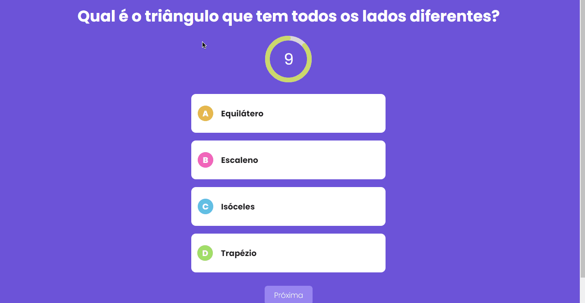

<p align="center">
  <a href="#-tecnologias">Tecnologias</a>&nbsp;&nbsp;&nbsp;|&nbsp;&nbsp;&nbsp;
  <a href="#-projeto">Projeto</a>&nbsp;&nbsp;&nbsp;|&nbsp;&nbsp;&nbsp;
  <a href="#-layout">Layout</a>&nbsp;&nbsp;&nbsp;|&nbsp;&nbsp;&nbsp;
  <a href="#memo-licença">Licença</a>
</p>

<p align="center">
 

  
</p>

<br>

<p align="center">
  
</p>

## 🚀 Tecnologias

Esse projeto foi desenvolvido com as seguintes tecnologias:

- ReactJS
- Next.js

Bibliotecas

- [Google Fonts](https://fonts.google.com/)
- [React Countdown Circle Timer](https://www.npmjs.com/package/react-countdown-circle-timer)

## 💻 Projeto

Projeto de um quiz com perguntas baseadas no programa de televisão "Show do Milhão", desenvolvido utilizando ReactJS e Next.js.

Você pode visitar o site [clicando aqui](https://darllinsonazvd.github.io/smartdesign-site/)

## 📝 Licença

Esse projeto está sob a licença MIT. Veja o arquivo [LICENSE](.github/LICENSE.md) para mais detalhes.

## ▶ Getting Started

Rode a aplicação no servidor de desenvolvimento:

```bash
npm run dev
# or
yarn dev
```

Abra [http://localhost:3000](http://localhost:3000) em seu navegador e veja o resultado.
